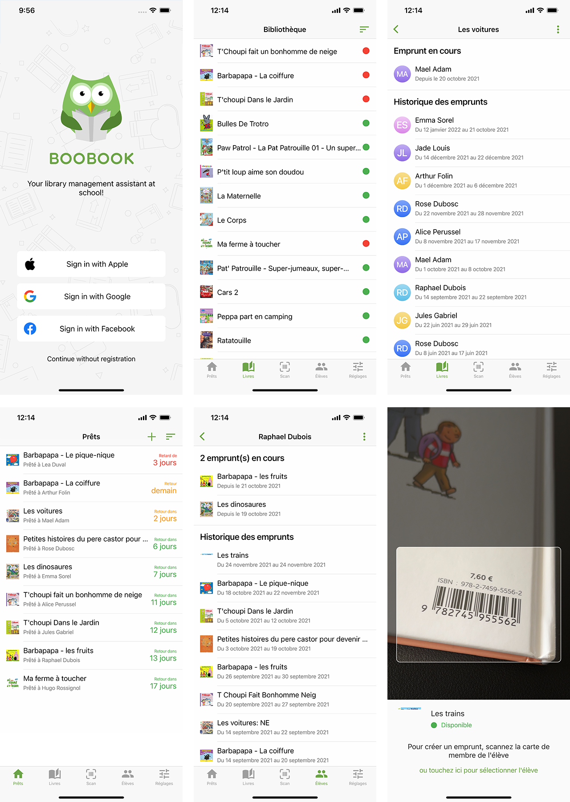

[](https://twitter.com/hikeland)


# Boobook

[](https://apps.apple.com/app/boobook/1585948226)
[](https://play.google.com/store/apps/details?id=net.jlbiz.boobook)

This open-source project shows how to build a Flutter app with:
- [x] [Firebase Authentication](https://firebase.google.com/products/auth) to handle user authentication
- [x] [Firebase Firestore](https://firebase.google.com/products/firestore) for a reactive database
- [x] [Riverpod](https://pub.dev/packages/riverpod) to handle state management
- [x] [RevenueCat](https://www.revenuecat.com/) to configure in-app subscription easily
- [x] [ISBNdb](https://pub.dev/packages/isbndb_flutter) to fetch the books from their ISBN code

A lot of other topics are also covered by this project:
- [x] Learn the repository pattern architecture
- [x] Simple routing with homemade router (Navigator 1.0)
- [x] Use the dedicated OS components (**CupertinoScaffold** on iOS vs **Scaffold** on Android, for example)
- [x] Handle localization thanks to **flutter_localizations** and **Riverpod**
- [x] Reuse components through all your apps made with Flutter



## App Overview

Boobook is a simple book library manager designed for teachers, to manage book loans to pupils. 
The application is composed by five primary screens: **Loans**, **Books**, **Scan**, **Pupils**, and **Settings**.

On the first launch, the app asks the user to sign-in. This step can be skiped by selecting "Continue without account", which leads to the creation of an anonymous user on Firebase.

The **Loans** page displays the books which are currently loaned, with the remaining time before the expected return of the book. This time is displayed in green if it's far away, in orange for the last days, and in red if the date has been exceeded. Tap on a loan opens some options that allow you to end up the loan, or to extend it if needed.

Open the **Books** page to see the list of your books. A colored dot indicates whether the book is available or not. Tap on a book to edit its name or its cover picture.

In the **Pupils** page, you can see the list of your pupils, with the number of current loans. You can print all the membership cards at once by tapping on the top-right button. Tap on a pupil to edit his name or his card picture, or also to print his member card. 

Use the **Scan** page to open your device camera and be able to scan a book. If the book is not yet in your book list, you will be offered to add it, and if it's already added, you will be offered to scan a pupil card or pick a pupil in your list, to create a new loan.

Finally, the **Settings** page allows you to setup some features: the max number of simultaneous loans, the default duration for a loan, the title on the membership cards. Some appearance settings are also available, such as the default language displayed and the theming of the app (light or dark).

## Features

- Register all your books, by adding them manually or by scanning their barcode
- Create all your pupils, which will generate for you member cards that you can print out to give to your pupils
- Scan a book and a membership card to generate a loan in a few seconds! 
- Online data persistence with Firestore

## App Structure

The project folders are structured like this:

```
/controllers
/models
/l10n
/presentation
  /common_widgets
  /routes
  /theme
  /views
    /home
      /codes
      /loans
      /pupils
      /scan
      /settings
      /subscription
    /sign_in
    /splash
/repositories
```

`lib` folder only contains **main.dart** which contains the main Widget to make the app launchable, and **common_providers.dart** which includes some providers reused all accross the code.

Then inside `lib` you will find:
- `controllers` which contains our "freezed" state files
- `models` which contains all the models (generated with [Freezed](https://pub.dev/packages/freezed))
- `l10n` with contains the arb files for localization
- `presentation` with all the ui stuff (subfolders detailed below)
- `repositories` which contains the repositories used to access the database

### presentation 

`presentation` is divided in subfolders:
- `common_widgets` with all the widgets which are used more than once
- `routes` which contains the app router
- `theme` which contains the layout stuff
- `views` which contains the pages.

### views 

`views` is also divided in subfolders:
- `home` which contains the content of the app once the user is logged in
- `sign_in` which contains the sign in page
- `splash` which contains the splash page, ie the first view loaded when the app starts

### home 

`home` is generally divided with subfolders for each part of the app, usually once per tab when using a TabScaffold. 

## Missing files in the repository

Some files are voluntary missing in the repository, for security reasons:
- `android/app/google-services.json` which is the file to make Firebase work on Android devices
- `ios/Runner/GoogleService-Info.plist` which is the file to make Firebase work on iOS devices
- `ios/Runner/Info.plist` which I decided to hide because it clearly displays the Facebook app secret for Facebook Login
- `lib/config.dart` which is detailed below

## config.dart

The app requires this dart file to work:

```dart
final isbnApiKey = "your_isbndb_api_key";

const purchasesApiKey = 'your_revenuecat_api_key';
const entitlementId = 'your_purchase_entitlement';

const privacyPolicyURL = "https://boobook.app/privacy";
const termsURL = "https://www.apple.com/legal/internet-services/itunes/dev/stdeula/";

class FirestorePath {
  static String pupils = "pupils";
  static String books = "books";
  static String loans = "loans";
  static String users = "users";
}

class StoragePath {
  static String users = "users";
  static String pupils = "pupils";
  static String books = "books";
}
```

## Something important about the way the source code is built 

This source code refers to a lot of personal Flutter packages hosted on my GitHub repository.
These packages have been created for my personal Flutter projects because I reuse a lot of code accross all my Flutter projects to avoid too much copy and paste across all my projects.
If you want to understand all the source code of Boobook, you will need to have a look to each package the code refers to:

- [x] [avatar](https://github.com/julienlebren/flutter_packages/tree/main/packages/avatar) generates a profile picture with a photo or a fallback with initials
- [x] [extensions](https://github.com/julienlebren/flutter_packages/tree/main/packages/extensions) brings some extensions on common classes that I use a lot in all my apps
- [x] [firestore_service](https://github.com/julienlebren/flutter_packages/tree/main/packages/firestore_service) is a class that helps to handle data from Firestore
- [x] [firebase_storage_service](https://github.com/julienlebren/flutter_packages/tree/main/packages/avatar) is a class that helps to upload or download files from Firebase Storage
- [x] [layout_builder](https://github.com/julienlebren/flutter_packages/tree/main/packages/layout_builder) brings all the layout stuff I use in my apps with ready-to-use cross-platform widgets
- [x] [photo_upload](https://github.com/julienlebren/flutter_packages/tree/main/packages/photo_upload) is a ready-to-use widget+controller to upload pictures using `firebase_storage_service`
- [x] [sign_in](https://github.com/julienlebren/flutter_packages/tree/main/packages/sign_in) is a ready-to-use widget+controller to handle authentication with Firebase Auth
- [x] [purchases](https://github.com/julienlebren/flutter_packages/tree/main/packages/purchases) bring some help to handle in-app purchases using [RevenueCat](https://revenuecat.com)]

These packages are hosted on my GitHub repository and not as official packages on [pub.dev](https://pub.dev) because they are built only to fit my personal needs and I regulary make important breaking changes.

## Future Roadmap

- [ ] Generate and print custom barcodes in order to handle magazines inside the app (magazines do not have ISBN like books so they cannot be handled by scanning the barcode like a book)
- [ ] Change the way to display account details in the Settings tab
- [ ] Better display of the subscription, with maybe some alert when the free quota is about to be reached
- [ ] Avoid to scope localizationProvider